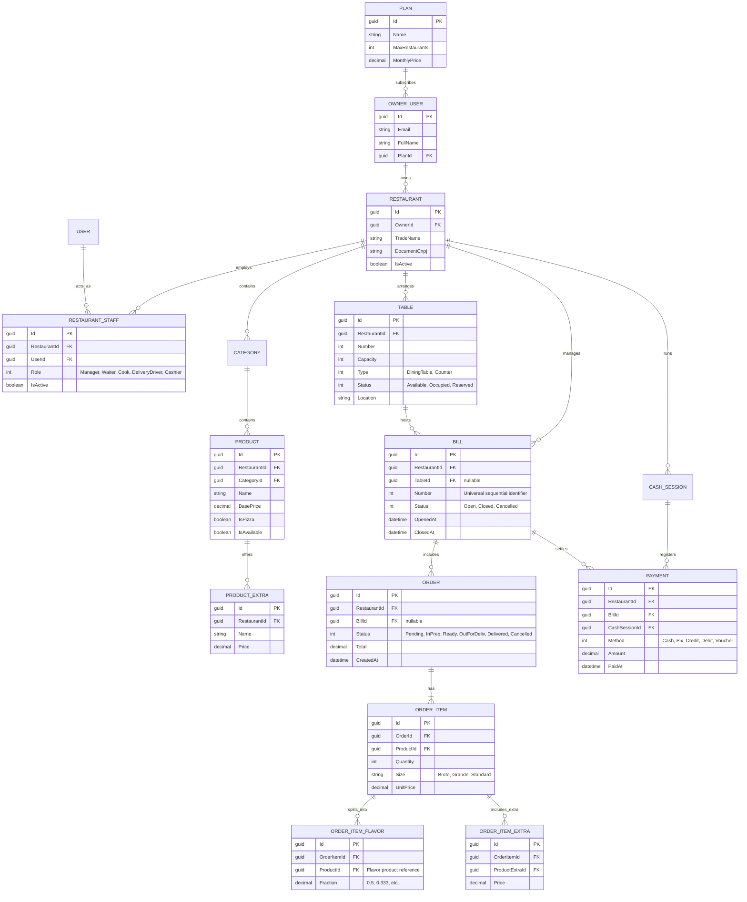

# Modelo de Domínio e Relacionamentos (ER)

Este documento ilustra a arquitetura de entidades do Komari, incorporando suporte a Multi-Tenancy (SaaS), composição de pizzas fracionadas, adicionais customizados e comandas flexíveis.

---

## 📊 Diagrama Entidade-Relacionamento (ER)

---

## 🧩 Agregados DDD Principais

1. **Conta e Assinatura SaaS (`Subscription Aggregate`)**:
   - `OwnerUser`, `Plan`, `Restaurant`.
   - Limita a criação de restaurantes ao teto do plano contratado.

2. **Equipe e Autorização (`Staff Aggregate`)**:
   - `RestaurantStaff`, vinculando `User` com uma `Role` restrita a um `RestaurantId`.

3. **Catálogo & Adicionais (`Catalog Aggregate`)**:
   - `Category`, `Product` e `ProductExtra`.
   - Suporte a itens convencionais e itens do tipo pizza com múltiplos sabores e bordas.

4. **Mesas e Comandas (`Table & Bill Aggregate`)**:
   - `Table` e `Bill` (numerada, com ou sem mesa associada, suporte a divisão por pagantes).

5. **Produção e Pedidos (`Order Aggregate`)**:
   - `Order`, `OrderItem`, frações de sabores (`OrderItemFlavor`) e adicionais (`OrderItemExtra`).

6. **Caixa e Pagamentos (`Cashier Aggregate`)**:
   - `CashSession`, `Payment` e `CashMovement`.
