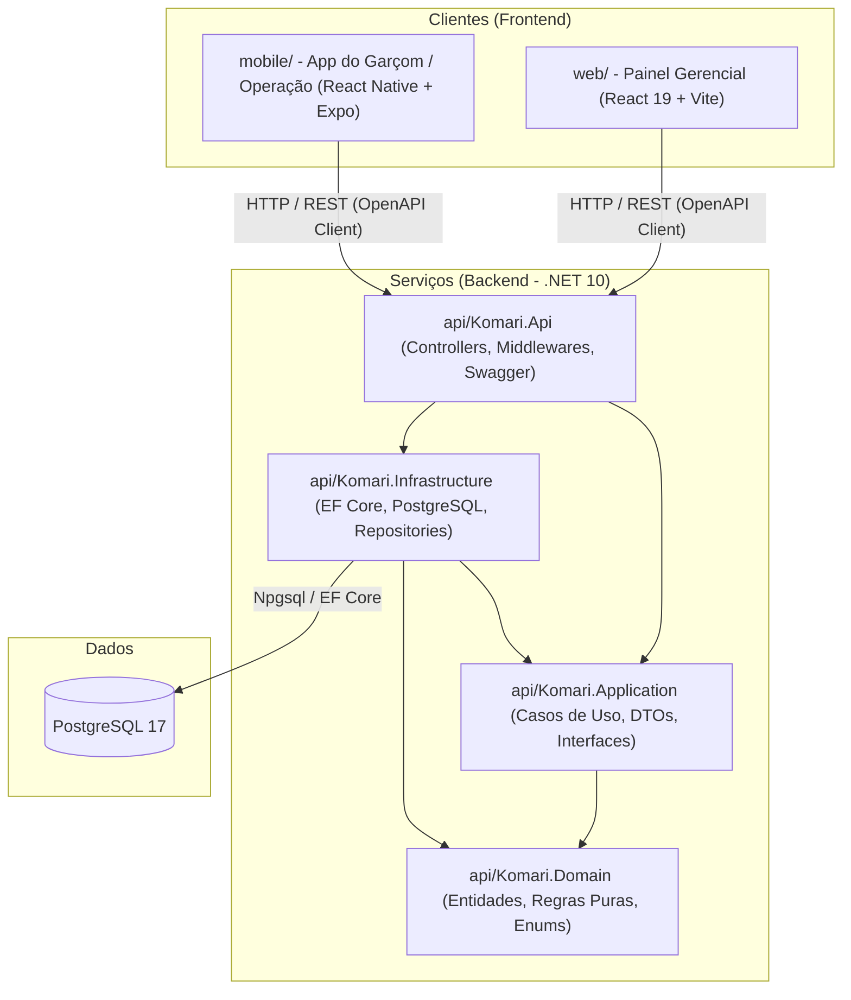

# Visão Geral da Arquitetura do Komari

Este documento descreve como os componentes do repositório interagem e como a informação flui através das camadas do sistema.

---

## 🏛️ Topologia do Monorepo

O projeto é mantido em um único repositório (*monorepo*) para garantir alinhamento contínuo entre os contratos de API e seus consumidores:

---

## 🔄 Fluxo de Uma Requisição (Clean Architecture)

Seguindo os princípios da Clean Architecture:
1. **Cliente (`web` ou `mobile`)** faz uma requisição HTTP tipada a partir do cliente gerado pelo OpenAPI.
2. **`Komari.Api`** recebe a chamada em um Controller fino, executa validação de formato e repassa a responsabilidade para a camada de Application.
3. **`Komari.Application`** orquestra o caso de uso (busca dados através de interfaces de repositório, invoca métodos de domínio e persiste as alterações).
4. **`Komari.Domain`** valida regras de negócio invariantes dentro das entidades (ex: mesa não pode ter capacidade negativa; produto inativo não pode ser adicionado a pedido novo).
5. **`Komari.Infrastructure`** implementa o acesso ao banco com `DbContext` do Entity Framework Core e mapeamentos fluentes (`IEntityTypeConfiguration`).

---

## 🔐 Princípios Arquiteturais Inegociáveis

1. **Domínio Rico e Isolado**: O projeto `Komari.Domain` não possui referências a bibliotecas de banco de dados ou frameworks externos. Entidades protegem seu próprio estado (setters privados e métodos mutadores explicativos).
2. **Sem Exposição Direta de Entidades**: Endpoints HTTP nunca retornam ou recebem entidades do EF Core. Toda entrada e saída é mediada por DTOs específicos.
3. **Validação em Duas Etapas**: O frontend valida para prover feedback instantâneo ao usuário; a API valida rigorosamente toda entrada para garantir integridade e segurança.
4. **Assincronismo Total**: Todas as operações de I/O são implementadas com `async/await` e propagam `CancellationToken`.
