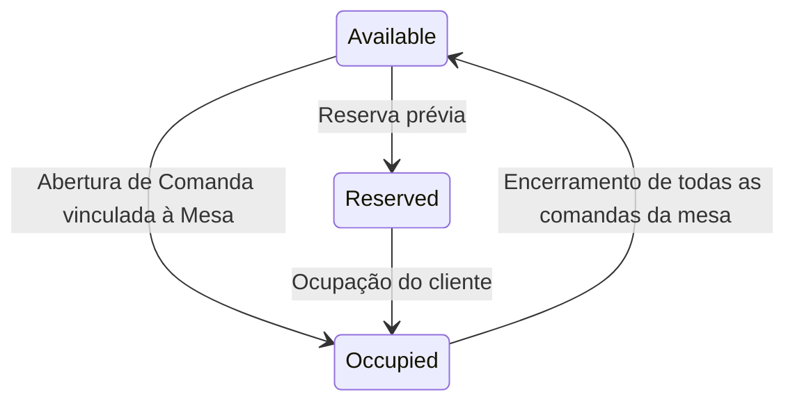

# Regras de Negócio: 02 - Mesas e Comandas

Este documento estabelece as regras e o ciclo de vida para o gerenciamento de mesas de salão, posições de balcão e comandas de consumo.

---

## 1. Mesas e Balcão (`Table`)

### 1.1 Invariantes e Configuração Flexível
- **Número Identificador (`Number`)**: Deve ser um número inteiro estritamente positivo (`> 0`), único dentro do restaurante.
- **Capacidade (`Capacity`)**: Pelo menos 1 lugar (`>= 1`).
- **Modalidade (`TableType`)**:
  - `DiningTable (1)`: Mesa convencional de salão para refeições.
  - `Counter (2)`: Posição individual de atendimento no balcão.
- **Configuração Simplificada**: O painel do lojista permite cadastrar mesas individualmente ou gerar rapidamente em lote uma faixa de mesas (ex: gerar mesas de 1 a 30 de uma só vez), definindo capacidade padrão.

### 1.2 Estados Operacionais da Mesa (`TableStatus`)

- **`Available (1)`**: Mesa livre.
- **`Occupied (2)`**: Possui uma ou mais comandas ativas consumindo.
- **`Reserved (3)`**: Bloqueada para reserva.

---

## 2. Comandas (`Bill` / `Tab`)

### 2.1 Identificação e Tipos de Atendimento
- **Numeração Obrigatória**: **Todas as comandas possuem um número identificador sequencial** para fácil localização física e controle pela equipe (ex: Comanda nº 104).
- **Tipos de Vínculo**:
  1. **Comanda Vinculada a Mesa**: Atendimento de salão. Ao ser aberta, altera automaticamente o status da mesa para `Occupied`.
  2. **Comanda Avulsa (Sem Mesa)**: Utilizada para consumo direto em balcão, clientes em pé, eventos ou pedidos de retirada imediata (take-away).
- O lojista pode definir faixas de numeração de comandas físicas disponíveis no estabelecimento.

### 2.2 Divisão de Conta por Pessoa
- No momento do encerramento da comanda (ou da mesa), o sistema oferece suporte nativo à **Divisão por Pessoa**:
  - O operador informa a quantidade de pessoas pagantes (ex: 4 pessoas).
  - O sistema calcula o valor por pessoa:
    $$\text{Valor por Pessoa} = \frac{\text{Saldo Devedor}}{\text{Quantidade de Pessoas}}$$
  - O sistema permite registrar pagamentos parciais individuais (ex: Pessoa 1 paga R$ 50 no PIX, Pessoa 2 paga R$ 50 no Cartão, etc.) até que a conta total seja completamente liquidada.

### 2.3 Regras para Encerramento da Comanda
1. **Pedidos em Aberto**: A comanda não pode ser encerrada se houver pedidos em status `Pending` ou `InPreparation`. Os pedidos devem estar entregues (`Delivered`) ou cancelados (`Cancelled`).
2. **Saldo Zero**: O valor total da comanda deve estar 100% quitado com os pagamentos registrados no Caixa.
3. **Liberação de Mesa**: Ao quitar e fechar a última comanda vinculada a uma mesa, a mesa retorna instantaneamente para `TableStatus.Available`.
