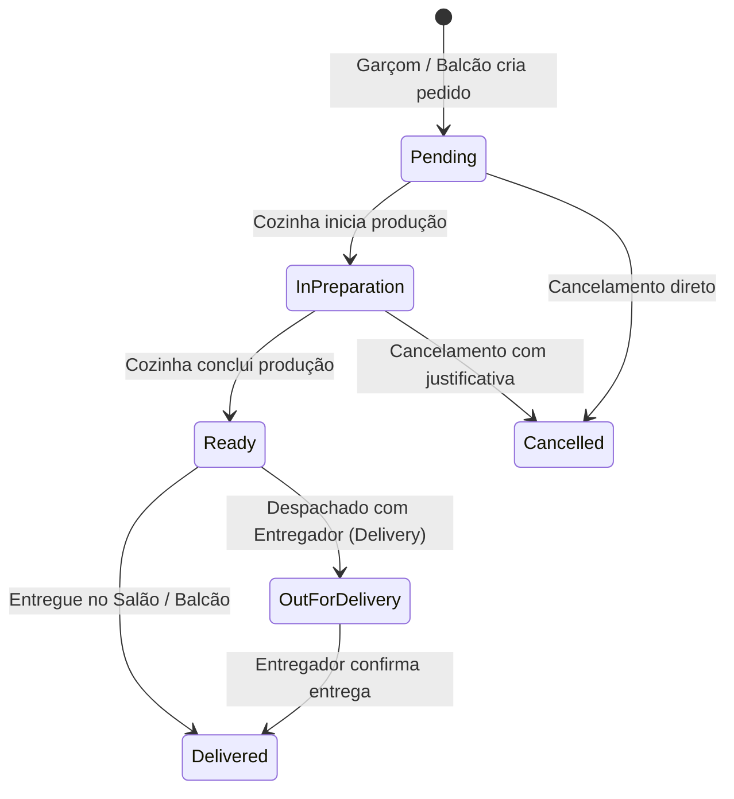

# Regras de Negócio: 03 - Pedidos e Fluxo de Cozinha (KDS)

Este documento detalha o ciclo de vida dos pedidos (`Order`), a transição de seus itens e a operação do sistema de cozinha (*Kitchen Display System* - KDS).

---

## 1. Ciclo de Vida do Pedido (`OrderStatus`)

Os pedidos percorrem uma máquina de estados estrita:

### Definição dos Estados:

| Status | Descrição | Quem Altera |
| :--- | :--- | :--- |
| **`Pending`** | Pedido criado e enfileirado aguardando aceite da cozinha | Sistema / Garçom / Operador |
| **`InPreparation`** | Itens em processo de cocção/montagem na cozinha | Cozinha (KDS) |
| **`Ready`** | Itens prontos para serem servidos à mesa ou despachados para viagem | Cozinha (KDS) |
| **`OutForDelivery`** | Pedido em trânsito com motoboy/entregador (exclusivo para Delivery) | Expedição / Operador de Caixa |
| **`Delivered`** | Pedido entregue com sucesso ao cliente final | Garçom / Entregador |
| **`Cancelled`** | Pedido abortado | Gerente / Operador |

---

## 2. Regras de Transição e Cancelamento

1. **Snapshot de Preço**: O valor unitário do item no momento da criação do pedido é imutável. Alterações futuras no preço do produto no cardápio **não alteram** o valor de pedidos já gerados.
2. **Cancelamento de Pedidos**:
   - No status **`Pending`**: pode ser cancelado sem impacto de perda de matéria-prima.
   - No status **`InPreparation`** ou **`Ready`**: cancelamento exige **justificativa obrigatória** registrada em log para controle de desperdício/auditoria de insumos.
   - No status **`Delivered`**: o pedido **não pode** ser cancelado diretamente. Qualquer estorno deve ser tratado no módulo financeiro/caixa como devolução.
3. **Observações de Preparo**: Cada item do pedido pode conter notas personalizadas do cliente (ex: *"Sem cebola"*, *"Ponto da carne bem passado"*, *"Molho à parte"*).
